# ODI — Navigate Your Network

> **A lightweight mobile network utility for diagnostics, IP calculations, and networking education.**

**ODI** is a React Native mobile application designed to make common network troubleshooting tasks accessible from a simple mobile interface.

The name **ODI** is inspired by the traditional Maldivian *odi*, a vessel historically used for navigation between islands. The concept is reflected in the application's purpose: helping users **navigate and understand their network**.

ODI focuses on three practical diagnostic tools — **HTTP Reachability Check, DNS Lookup, and Port Check** — supported by persistent diagnostic history, networking calculators, educational content, and configurable light/dark themes.

**Tagline:** *Navigate Your Network.*

---

## 1. Project Description

ODI was developed for the **Mobile Applications (UFCF7H-15-3)** practical assessment using **React Native, Expo, and TypeScript**.

The application demonstrates core mobile-development concepts including:

* Multi-screen navigation
* React Context state management
* Persistent local storage
* External API integration
* Input validation and error handling
* Reusable React Native components
* Responsive mobile UI design
* Light and dark themes
* User testing
* Networking calculations and utilities

A key design principle of ODI is **technical honesty**. Features are labelled according to what the application can actually perform within the Expo/React Native environment. For example, ODI provides an **HTTP Reachability Check** rather than presenting an HTTP request as an ICMP ping.

---

# 2. Features

## 2.1 Home

The Home screen provides the main entry point into ODI and gives users quick access to the three diagnostic tools.

Users can quickly navigate to:

* Reachability Check
* DNS Lookup
* Port Check
* Saved diagnostic results

The interface uses a card-based layout intended to keep common actions immediately accessible.

### Screenshot — Home Screen

> 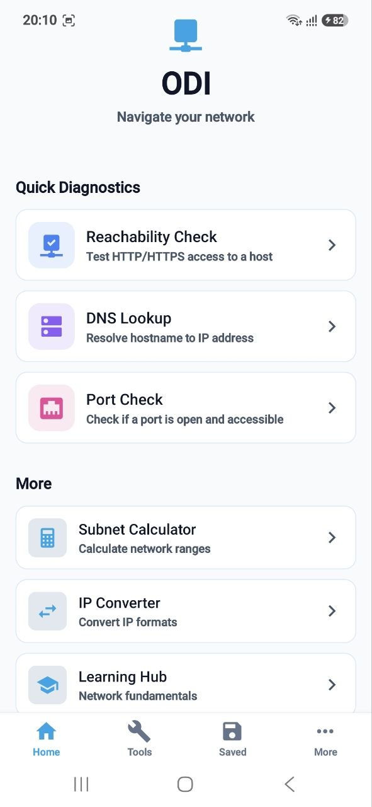

**Figure 1. ODI Home screen showing the main diagnostic shortcuts and bottom navigation.**

---

## 2.2 Reachability Check

The Reachability Check determines whether a host can be reached through **HTTP or HTTPS**.

The tool:

* Accepts a hostname or IP address
* Attempts HTTP/HTTPS communication
* Measures response time
* Reports HTTP status information when available
* Handles failed or timed-out requests
* Allows successful diagnostic results to be stored

ODI deliberately labels this feature as a **Reachability Check** rather than ICMP Ping because Expo Go does not provide direct raw ICMP functionality through standard JavaScript networking APIs.

### Screenshot — Reachability Check

> 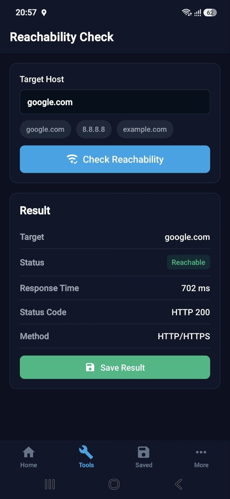

**Figure 2. Reachability Check displaying the result of an HTTP/HTTPS connectivity test.**

---

## 2.3 DNS Lookup

DNS Lookup allows users to resolve a hostname and inspect its IP address records.

The feature supports:

* Hostname validation
* IPv4 **A records**
* IPv6 **AAAA records**
* DNS error handling
* Result display and persistence

DNS queries use the **Google Public DNS API**.

### Screenshot — DNS Lookup

> 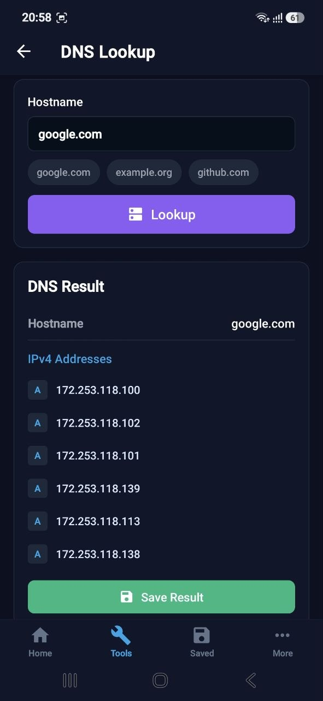

**Figure 3. DNS Lookup showing resolved A and AAAA records for a hostname.**

---

## 2.4 Port Check

Port Check allows users to test whether a selected network service/port is accessible on a target host.

Features include:

* Host/IP input
* Port-number validation
* Common service presets
* Service-name identification
* Response-time information
* Clear success/failure feedback

Common presets make frequently used services easier to test, including HTTP, HTTPS, SSH and DNS.

### Screenshot — Port Check

> 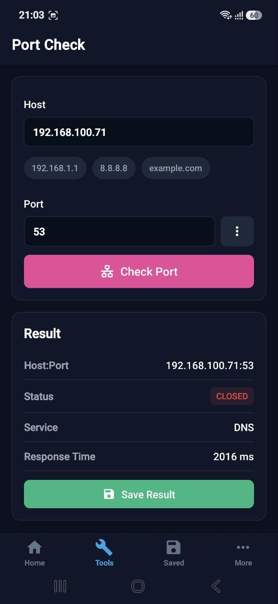

**Figure 4. Port Check showing the accessibility result for a selected host and service port.**

---

## 2.5 Saved Results

ODI can maintain a local history of diagnostic checks.

Diagnostic results contain information such as:

* Diagnostic type
* Target
* Result
* Timestamp
* Relevant response information

The data is persisted locally using **AsyncStorage**, allowing saved results to remain available after the application is closed and reopened.

Users can:

* View previous results
* Open an individual result
* Review diagnostic details
* Delete results

### Screenshot — Saved Results

> 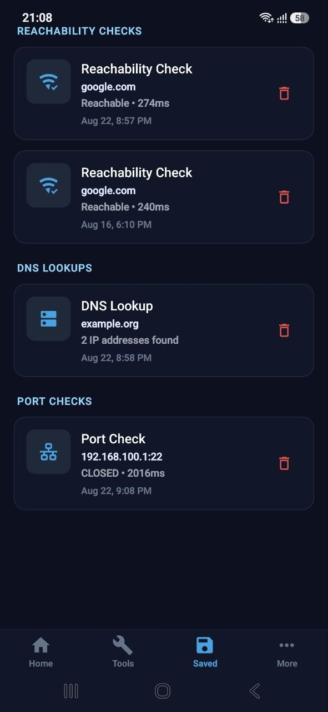

**Figure 5. Saved Results screen showing persistent diagnostic history stored using AsyncStorage.**

### Screenshot — Saved Result Details

> 

**Figure 6. Saved Result Details screen displaying information from a previously stored diagnostic check.**

---

# 3. Networking Utilities

## 3.1 IPv4 Subnet Calculator

The IPv4 Subnet Calculator helps users calculate subnet information from an IPv4 address and CIDR prefix.

Calculated information includes:

* Network address
* CIDR prefix
* Subnet mask
* Broadcast address
* Host range
* Number of usable hosts

This functionality is calculated locally and therefore does not require an external API.

### Screenshot — Subnet Calculator

> 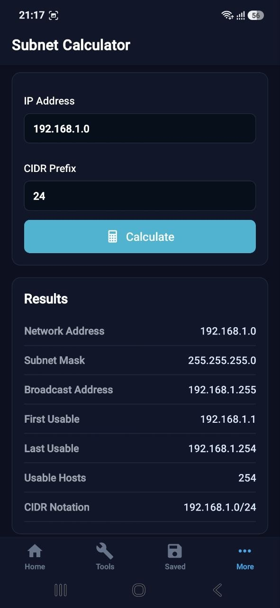

**Figure 7. IPv4 Subnet Calculator displaying calculated network, broadcast and usable host information.**

---

## 3.2 IP Converter

The IP Converter demonstrates how an IPv4 address can be represented using different numerical formats.

Supported representations include:

* Dotted decimal
* Binary
* Hexadecimal
* Integer

### Screenshot — IP Converter

> 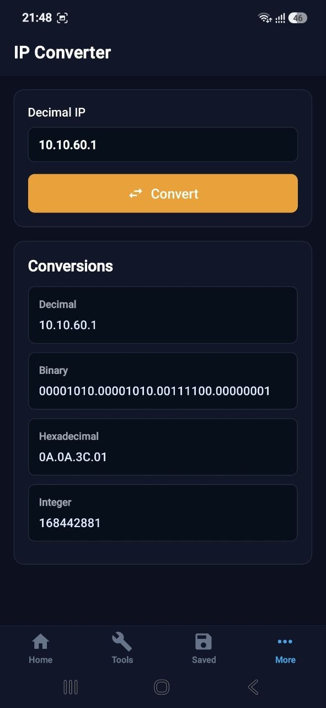

**Figure 8. IP Converter displaying an IPv4 address in decimal, binary, hexadecimal and integer formats.**

---

# 4. Learning Hub

The Learning Hub provides concise networking reference material directly within ODI.

Topics include:

* OSI Model
* TCP vs UDP
* Common Ports
* HTTP Status Codes
* Subnetting Basics

This section complements the diagnostic functionality by helping users understand the networking concepts behind the tools.

### Screenshot — Learning Hub

> 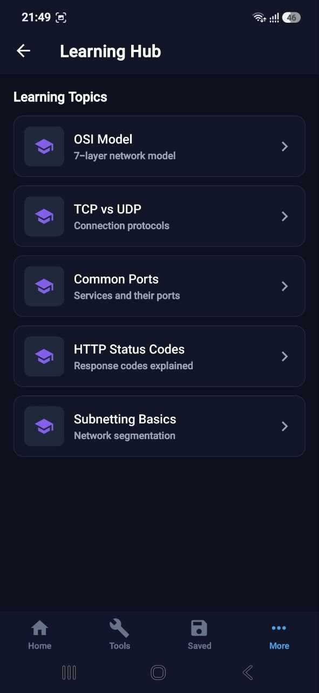

**Figure 9. ODI Learning Hub providing access to networking fundamentals and reference material.**

---

# 5. Settings

The Settings screen allows users to configure the application experience.

Current settings include:

* Light theme
* Dark theme
* Access to application information

The selected theme is stored locally so that the preference persists between application sessions.

### Screenshot — Settings

> 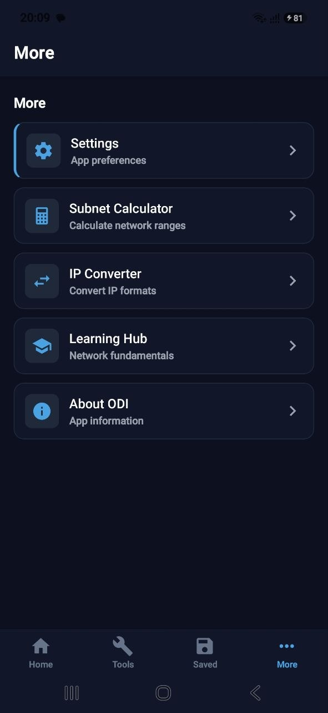

**Figure 10. Settings screen showing ODI's appearance options and application settings.**

### Screenshot — Dark Mode

> **INSERT SCREENSHOT HERE**

**Figure 11. ODI interface in dark mode, demonstrating persistent application theme state.**

---

# 6. About ODI

The About screen explains the purpose and identity of the application.

ODI's branding is based on the concept of navigation. The traditional Maldivian *odi* provides the metaphor for navigating between network devices, services and information.

### Screenshot — About

> 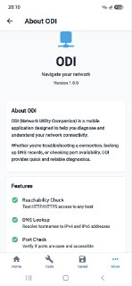

**Figure 12. About ODI screen presenting the application's purpose and identity.**

---

# 7. Navigation Flow

ODI uses a combination of **bottom-tab navigation and nested stack navigation**.

The primary navigation structure provides access to:

**Home | Tools | Saved | More**

Nested stack navigators are then used to open individual diagnostic tools, utilities, educational content and settings while maintaining a predictable navigation hierarchy.

### Screenshot — Main Navigation

> 


**Figure 13. ODI bottom-tab navigation providing access to Home, Tools, Saved Results and More.**

### Navigation Structure

```text
ODI
│
├── Home
│   ├── Reachability Check
│   ├── DNS Lookup
│   └── Port Check
│
├── Tools
│   ├── Reachability Check
│   ├── DNS Lookup
│   └── Port Check
│
├── Saved
│   └── Saved Result Details
│
└── More
    ├── Subnet Calculator
    ├── IP Converter
    ├── Learning Hub
    ├── Settings
    └── About ODI
```

---

# 8. Technologies Used

| Technology                 | Purpose                                     |
| -------------------------- | ------------------------------------------- |
| **React Native**           | Cross-platform mobile application framework |
| **Expo SDK 54**            | Development and mobile runtime environment  |
| **TypeScript 5.9.2**       | Type-safe application development           |
| **React Navigation**       | Bottom-tab and nested stack navigation      |
| **React Context API**      | Application-wide state management           |
| **AsyncStorage**           | Persistent local storage                    |
| **Google Public DNS API**  | DNS A/AAAA record resolution                |
| **@expo/vector-icons**     | Application icons                           |
| **MaterialCommunityIcons** | Consistent iconography                      |
| **@expo/ngrok**            | Tunnel-mode development/testing             |

---

# 9. Application Architecture

ODI separates user-interface, application-state, service and utility responsibilities.

```text
ODI/
├── src/
│   ├── components/       # Reusable UI components
│   ├── constants/        # Theme and application constants
│   ├── context/          # Theme and SavedResults state
│   ├── navigation/       # Tab and stack navigation
│   ├── screens/          # Application screens
│   ├── services/         # Network diagnostic services
│   ├── types/            # TypeScript definitions
│   └── utils/            # Validation and network calculations
│
├── App.tsx
├── app.json
├── package.json
├── README.md
├── DEVELOPMENT.md
└── USER_TESTING.md
```

This structure separates concerns and makes individual parts of the application easier to maintain and test.

---

# 10. State Management

ODI uses the **React Context API** for application-wide state.

Two primary areas use shared state:

### Theme Context

Responsible for:

* Current theme
* Switching between light and dark mode
* Restoring the user's saved theme preference

### Saved Results Context

Responsible for:

* Diagnostic result history
* Adding results
* Retrieving saved results
* Deleting results
* Synchronising state with persistent storage

This avoids unnecessary prop drilling while keeping state management appropriate for the application's scope.

---

# 11. Persistence

ODI uses **AsyncStorage** for local persistence.

Persistent information includes:

* Saved diagnostic results
* Diagnostic timestamps
* Theme preference

This allows important application state to survive application restarts.

Persistence can be demonstrated by:

1. Performing and saving a diagnostic.
2. Closing ODI.
3. Reopening the application.
4. Opening **Saved Results**.
5. Confirming that the previous result remains available.

### Screenshot — Persistence Evidence

> 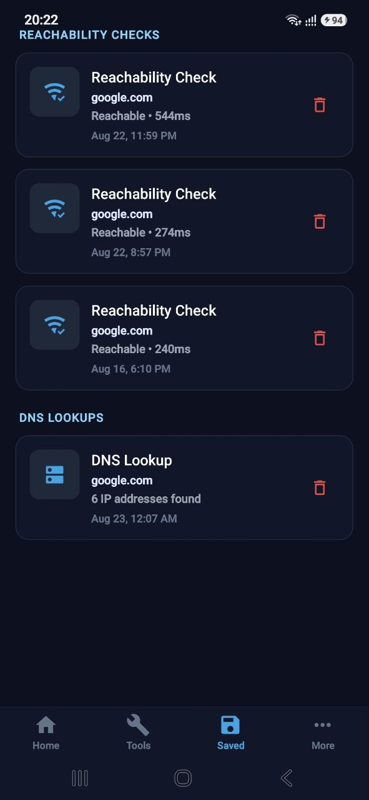

**Figure 14. Previously saved diagnostic result remaining available after restarting ODI, demonstrating AsyncStorage persistence.**

---

# 12. Installation and Run Instructions

## Prerequisites

Install the following before running ODI:

* Node.js 18 or later
* npm
* Git
* Expo Go on an Android or iOS device

---

## Clone the Repository

```bash
git clone <repository-url>
cd ODI
```

---

## Install Dependencies

```bash
npm install
```

---

## Start ODI

```bash
npm start
```

The Expo development server will start and display a QR code.

Scan the QR code using **Expo Go** on the test device.

---

## Tunnel Mode

If the mobile device cannot connect directly to the development machine over the local network:

```bash
npm run tunnel
```

Tunnel mode can be used to make the development server accessible when the test device and development computer are on different networks.

---

## TypeScript Validation

The project can be type-checked using:

```bash
npx tsc --noEmit
```

This verifies the TypeScript codebase without producing compiled output.

---

# 13. Error Handling and Validation

ODI includes validation and error handling to prevent common invalid operations.

Examples include:

* Empty host input
* Invalid IP address
* Invalid hostname
* Invalid port numbers
* DNS lookup failure
* HTTP request failure
* Request timeout
* Unreachable services
* Network connectivity problems

Rather than fabricating diagnostic results, the application reports unsuccessful operations to the user.

---

# 14. User Testing

ODI was evaluated through structured user testing with **five participants**.

The testing focused on:

* Discoverability of diagnostic tools
* Completion of core diagnostic tasks
* Navigation
* Saving and retrieving results
* Theme configuration
* General usability
* User understanding of diagnostic output

The testing process combined task scenarios, observation and participant feedback.

Full testing methodology, findings, evidence and recommendations are documented separately in:

```text
USER_TESTING.md
```

The testing identified both successful aspects of the interface and opportunities for future improvement.

---

# 15. Known Issues and Limitations

ODI intentionally operates within the limitations of a JavaScript-based Expo application.

### No Native ICMP Ping

The Reachability Check uses HTTP/HTTPS rather than raw ICMP Echo Requests.

Therefore, it should not be interpreted as a replacement for operating-system utilities such as:

```bash
ping
```

The interface explicitly communicates this distinction.

### Port Checking Limitations

Port accessibility can depend on:

* Target firewall configuration
* Mobile operating-system restrictions
* Network security policies
* Service behaviour
* Expo networking limitations

A failed request therefore indicates that ODI could not establish the expected connection; it does not necessarily prove that a host is completely offline.

### Internet Dependency

DNS Lookup uses the Google Public DNS API and therefore requires network connectivity.

### Platform Differences

Some networking behaviour can differ between Android and iOS because of operating-system security and networking restrictions.

---

# 16. Future Improvements

The current version deliberately focuses on a small number of reliable and understandable features rather than attempting to imitate networking capabilities unavailable within Expo.

Potential future improvements include:

* Native ICMP support through a custom React Native native module
* Traceroute functionality
* Improved TCP socket-based port testing
* Additional DNS record types such as MX, TXT, CNAME and NS
* Export diagnostic history to CSV or PDF
* Search and filtering for saved results
* Diagnostic result sharing
* Improved accessibility support
* Additional networking calculators
* Expanded Learning Hub material
* Network interface information
* Optional LAN discovery in a native application build
* Further Android and iOS usability testing

These improvements would require careful consideration of mobile operating-system permissions and native networking capabilities.

---

# 17. Key Design Decisions

## Why HTTP Reachability Instead of ICMP?

ODI uses HTTP/HTTPS reachability because raw ICMP is not directly available through the standard Expo Go JavaScript environment.

The decision provides:

1. **Technical honesty** — the feature is labelled according to what it actually tests.
2. **Compatibility** — the application remains usable through Expo Go.
3. **Maintainability** — no custom native module is required.
4. **Reliability** — results are generated by real network operations rather than simulated output.
5. **Appropriate project scope** — development effort remains focused on the assessed mobile-development concepts.

---

## Why AsyncStorage?

Diagnostic history and application preferences do not require a remote database.

AsyncStorage provides a lightweight solution suitable for:

* Local diagnostic history
* Theme preferences
* Offline persistence
* Simple structured application data

---

## Why Context API?

The application requires shared state but does not contain enough complex global state to justify a larger state-management library.

Context API therefore provides a suitable balance between simplicity and maintainability.

---

# 18. Assessment Evidence

ODI demonstrates the major mobile-development competencies required by the project.

| Area                 | ODI Evidence                                                                              |
| -------------------- | ----------------------------------------------------------------------------------------- |
| **UI/UX**            | Consistent card-based interface, responsive screens, light/dark themes and clear feedback |
| **Navigation**       | Four-tab navigation with nested stack navigation                                          |
| **State Management** | Theme and Saved Results Context providers                                                 |
| **Persistence**      | AsyncStorage diagnostic history and theme preference                                      |
| **Functionality**    | Three diagnostics, two calculators and Learning Hub                                       |
| **Code Quality**     | TypeScript and modular component/service/utility structure                                |
| **Testing**          | Structured user testing, validation and network error handling                            |
| **Documentation**    | README, DEVELOPMENT.md and USER_TESTING.md                                                |

---

# 19. Supporting Documentation

Additional project documentation is available in:

### `DEVELOPMENT.md`

Contains detailed information about:

* Application architecture
* Implementation decisions
* Components and services
* Development process

### `USER_TESTING.md`

Contains:

* Testing objectives
* Test environment
* Participant summaries
* Task scenarios
* Observation records
* Quantitative results
* Qualitative findings
* Recommendations
* Reflection
* User-testing evidence

---

# 20. Screenshot Checklist

Before submitting the repository, replace every screenshot placeholder above with an actual screenshot from the final application.

Recommended evidence:

* [ ] **Figure 1:** Home screen
* [ ] **Figure 2:** Reachability Check with result
* [ ] **Figure 3:** DNS Lookup with resolved records
* [ ] **Figure 4:** Port Check with result
* [ ] **Figure 5:** Saved Results history
* [ ] **Figure 6:** Saved Result Details
* [ ] **Figure 7:** Subnet Calculator with calculated result
* [ ] **Figure 8:** IP Converter with converted values
* [ ] **Figure 9:** Learning Hub
* [ ] **Figure 10:** Settings screen
* [ ] **Figure 11:** Dark mode
* [ ] **Figure 12:** About ODI
* [ ] **Figure 13:** Bottom navigation
* [ ] **Figure 14:** Persistence evidence after application restart

For stronger evidence, screenshots should show **completed interactions/results**, rather than only empty input screens.

---

# 21. Project Information

**Application:** ODI — Navigate Your Network
**Module:** Mobile Applications (UFCF7H-15-3)
**Framework:** React Native / Expo
**Language:** TypeScript
**Student:** Hawwa Saha Nasih
**Student ID:** S2400566

---

## License

MIT
